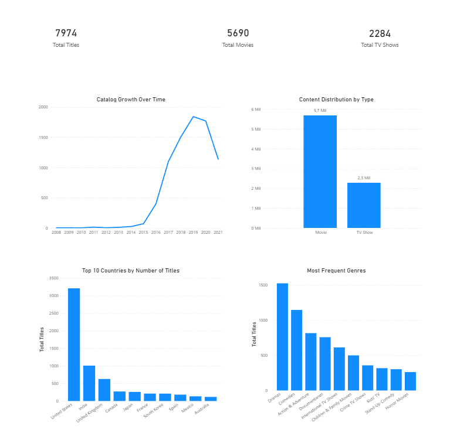

# Netflix Content Intelligence 📊🎬

## Project Overview
End-to-end data analysis and Business Intelligence project focused on exploring Netflix’s content catalog.  
The project covers the full analytics pipeline, from data cleaning and modeling in Python and SQL to executive-level visualization in Power BI.

The main objective is to identify patterns related to catalog growth, content types, geographic distribution, and genres.

---

## Business Questions
- How has Netflix’s content catalog evolved over time?
- What is the distribution between Movies and TV Shows?
- Which countries contribute the most to Netflix’s catalog?
- What are the most frequent content genres?

---

## Dataset
- **Source:** Kaggle – Netflix Movies and TV Shows
- **Records:** ~8,800 titles
- **Period covered:** 2015 – 2021

---

## Data Preparation & Modeling
The dataset required several preprocessing steps to ensure consistency across Python, SQL, and Power BI layers:

- Removal of duplicates and invalid records
- Extraction of year information from date fields
- Standardization of categorical columns (country, genre)
- Selection of primary country and main genre per title to avoid multi-value distortions in BI visuals
- Creation of BI-ready datasets aligned with SQL queries and Power BI measures

These steps ensured reliable aggregations and coherent insights across all tools.

---

## Challenges & Solutions
During the project, several real-world data challenges were addressed:

- **Multi-valued categorical fields:**  
  Columns such as country and genre contained multiple values per record. To maintain analytical clarity and avoid inflated counts, normalization rules were applied by keeping the primary country and main genre for each title.

- **Temporal inconsistencies:**  
  The year information extracted from dates required correction and standardization to avoid scaling issues in Power BI. The data was validated and adjusted to ensure accurate time-series analysis.

- **Cross-tool consistency:**  
  Aggregations and metrics were validated across Python, SQL, and Power BI to guarantee that results remained consistent throughout the pipeline.

These decisions reflect common challenges faced in real analytics and BI projects.

---

## Dashboard & Key Insights



**Key findings:**
- Movies represent approximately **70%** of Netflix’s catalog, while TV Shows account for **30%**
- Most titles were added **after 2015**, with accelerated growth until **2018**, followed by a slowdown
- The **United States** leads content production, followed by **India**, **United Kingdom**, **Canada**, and **France**
- The catalog shows strong emphasis on **international content**
- **Drama** and **Comedy** are among the most frequent genres

---

## Tools & Skills Demonstrated
- Python (pandas, matplotlib) for data analysis and cleaning
- SQL (SQLite) for structured querying and validation
- Power BI for interactive dashboards and storytelling
- Data modeling and BI-oriented transformations
- Git & GitHub for version control and project organization

---

## Project Structure
```
netflix-content-intelligence/
│
├── data/
│ ├── raw/ # Original dataset
│ ├── processed/ # Cleaned analytical dataset
│ └── bi/ # BI-ready dataset
│
├── notebooks/
│ └── netflix_analysis.ipynb
│
├── sql/
│ └── netflix_analysis.sql
│
├── powerbi/
│ └── netflix_content_intelligence.pbix
│
├── images/
│ └── dashboard_preview.png
│
└── README.md
```
